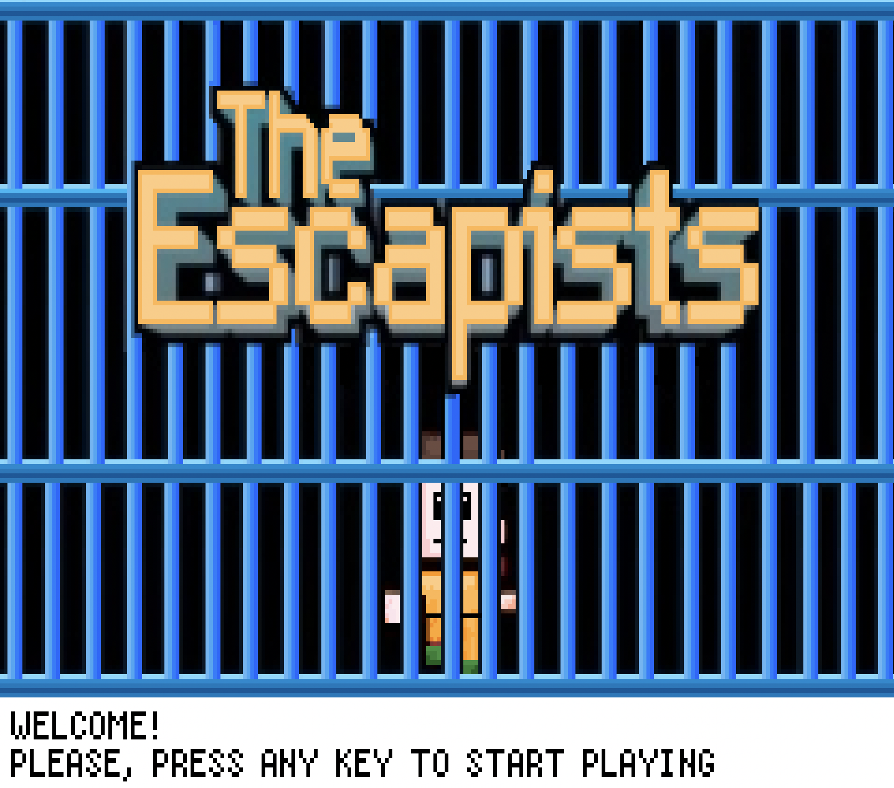
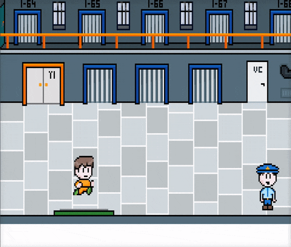
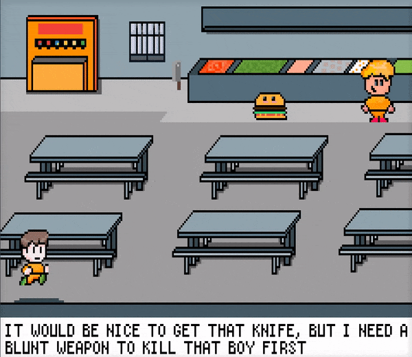
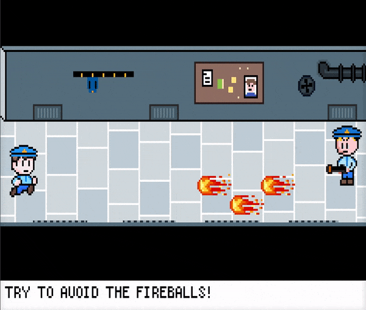
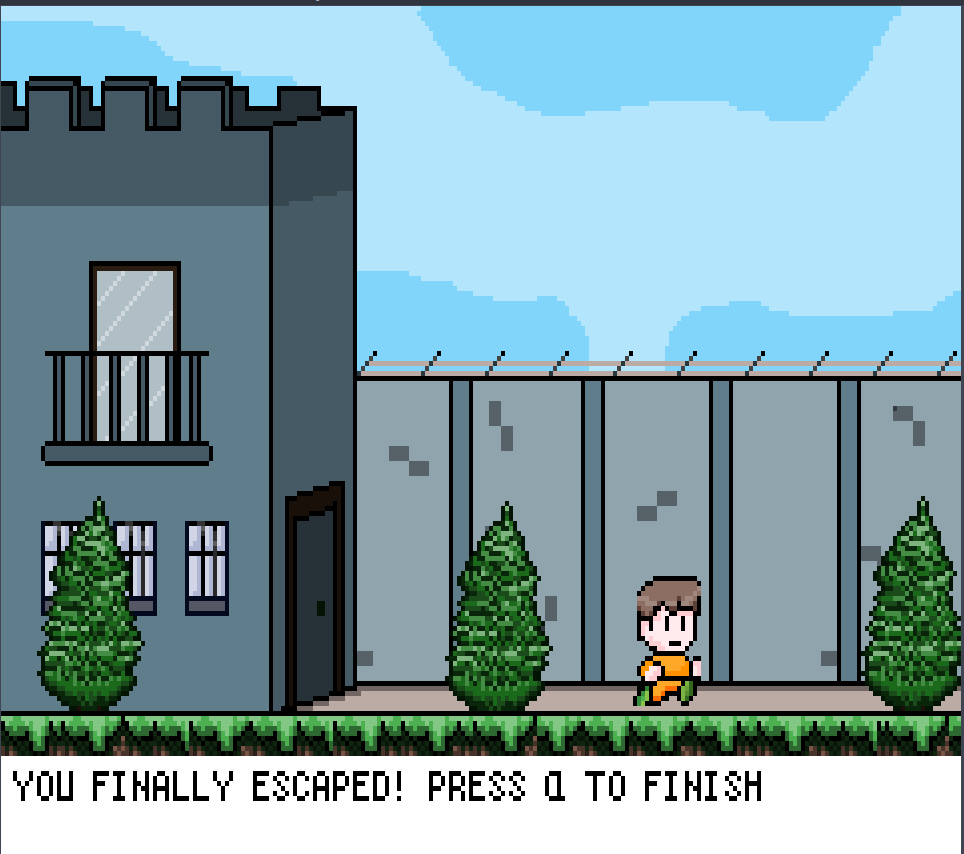

# The Escapists

This game was developed for the PPROG (Programming Project) course at UAM by [Guillermo García Cobo](https://github.com/atmguille), [Jesús Morato Martín](https://github.com/mapachepurpuratouris) and me. Since the game had to be terminal based we decided to print spaces as if they were pixels. 



## Requirements

This game is meant to run on UNIX machines, since it uses the termios API. To play sounds you will need `afplay` on macOS or `aplay` on Linux, which are usually installed by default. 

## How to run the game

First of all we must compile the game.

```bash
make
```

Then, we have to make the terminal's font as small as possible. 

 Finally, we can run the game running the following commands

```bash
./main
```

## Game description

The main objective of the game is to escape from a high security prison. To do so, there are **three** possible ways that the player could use to break out from the prison, so we invite you to discover all of them while playing!

In the process, the player can move around the prison using the arrow keys, changing between rooms if the character approaches to any of the doors. An example is shown in the following gif:



To advance in the game, some challenges need to be completed, but do not worry, the player is guided by the comments found at the bottom of the screen. Some examples of these challenges are looking for hidden passwords, discovering hidden rooms, collecting objects, fighting against inmates and guards, ... Moreover, the character can die, so be very careful! Here are two examples of the most risky challenges, which are run in separate threads:




Furthermore, this adventure is accompanied with a selection of sounds, whenever the character catches an object, kills another character, crosses a locked door or reaches the final map!

We hope you enjoy the game and that, sooner or later, you reach this final map.


